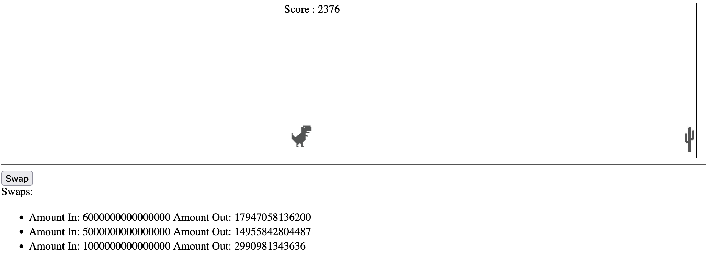

## MUD Powered Balancer Swaps

Entry to the [EthGlobal Autonomous Worlds hackathon](https://ethglobal.com/events/autonomous)

A demo project showing how MUD could be used with an existing DeFi protocol. In this case by creating a new Balancer Relayer that was integrated with MUD and a front end to show swap data.

See full write up [here](http://pitchandrolls.com/2023/05/22/a-muddy-defi-world/)

